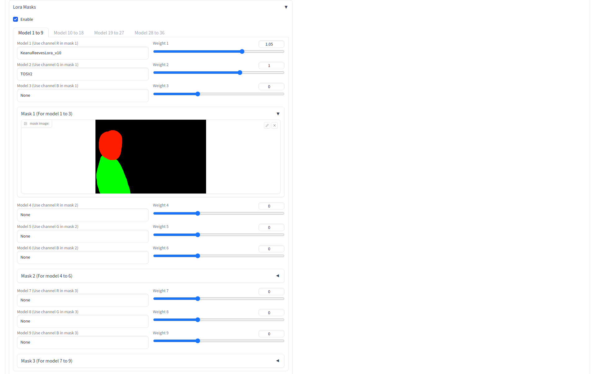
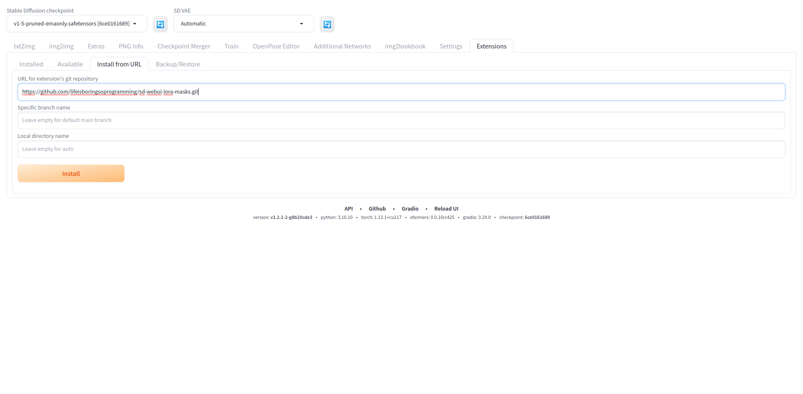
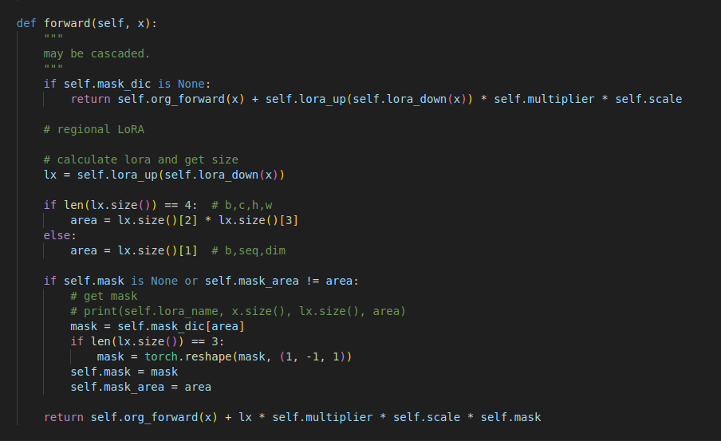
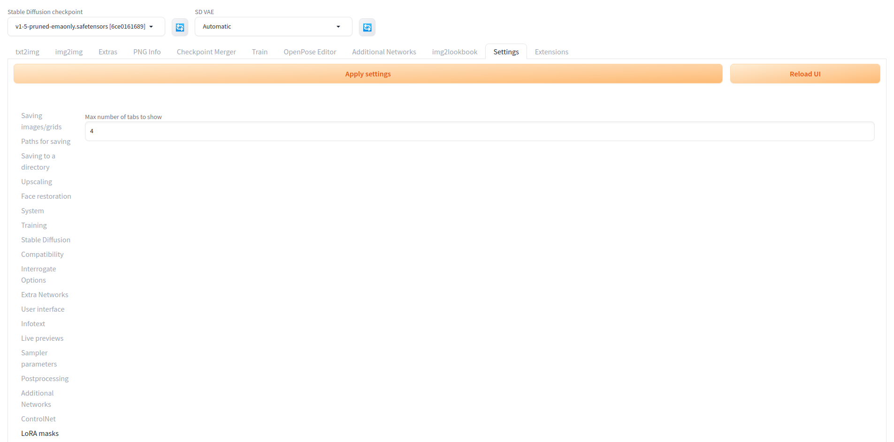
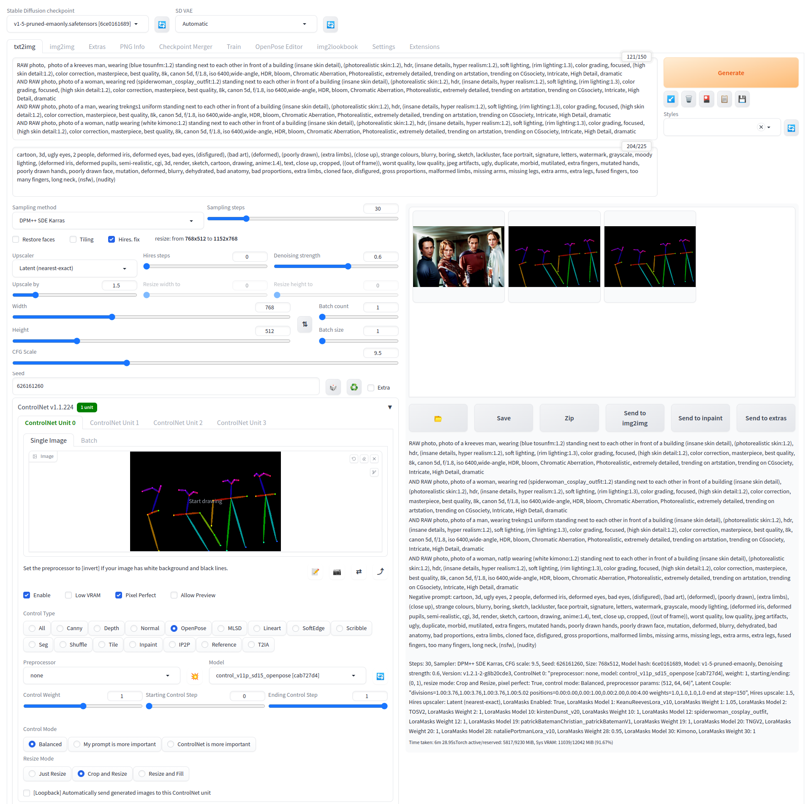
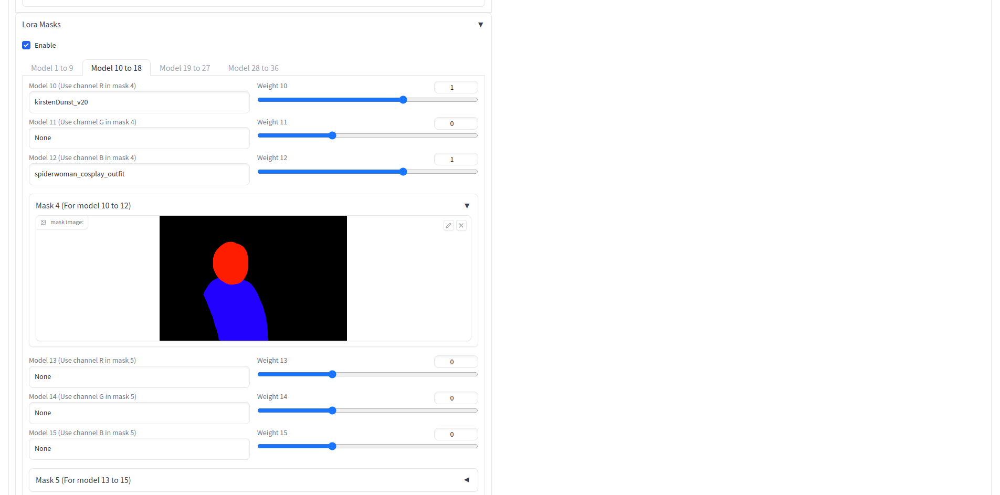
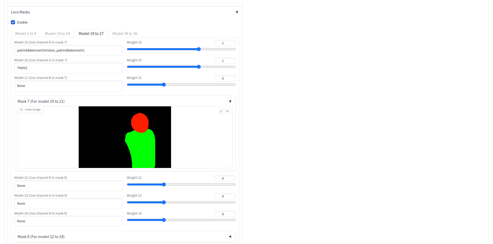
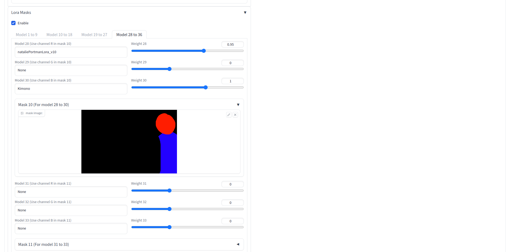
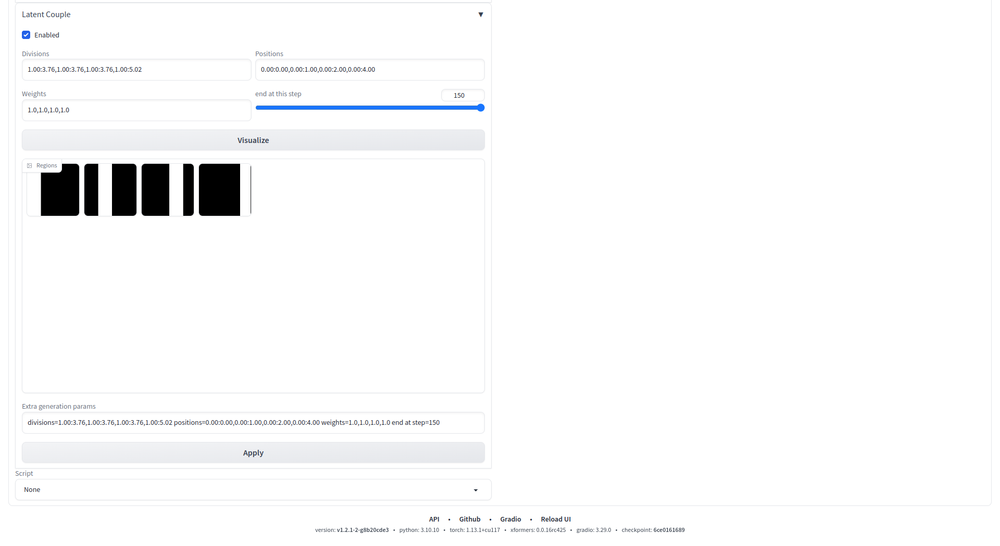
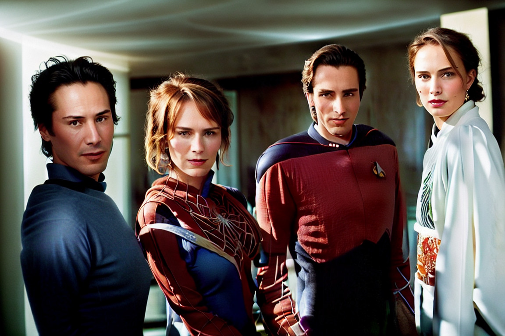

# Stable Diffusion LoRA masks extension
A custom extension for [AUTOMATIC1111/stable-diffusion-webui](https://github.com/AUTOMATIC1111/stable-diffusion-webui) that allow applying mask to LoRA models. The core of the feature and most UI are from [kohya-ss/sd-webui-additional-networks](https://github.com/kohya-ss/sd-webui-additional-networks)

# Overview
* This project allows users to add mask area for the LoRA models
* It support any number of LoRA models and masks
* For each group of three LoRA models 1, 2, 3, user can specify a RGB image to mask the area of effect for those LoRA models
* Channel R corrsponding to the LoRA model 1 in the group, channel G for model 2, channel B for model 3
* the weight of each LoRA model is the product of the LoRA weight and the value in the corrsponding RGB channel
* For example, a value 128 in the channel R and weight value 1.0 in the weight slider equals (128 / 255) * 1.0 ~= 0.5

# Tutorial
There is a video to show how to use the extension

# Stable Diffusion extension
This project can be run as a stable Diffusion extension inside the Stable Diffusion WebUI.

## Installation for stable Diffusion extension
* Copy and paste `https://github.com/lifeisboringsoprogramming/sd-webui-lora-masks.git` to URL for extension's git repository
* Press Install button
* Apply and restart UI when finished installing

# Differences from sd-webui-additional-networks
* Lora models are put in standard stable diffusion models Lora folder instead of a separate extension folder
* Only the UI in txt2img and img2img are implemented, the extension tab is removed
* The network dropdown box is removed
* The weights for the UNet/Text Encoder cannot be separated, only one slide to control the LoRA weight
* The LoRA dropdown box is replaced with input text field, you can just copy the filename of the LoRA model to the input field (i.e you input libspgc for the file [libspgc.safetensors](https://civitai.com/models/33206/lifeisboring-virtual-girl-01-morgan))
* There is a mask image available for every 3 LoRA models instead of just one mask image available
* Added tabs to group a set of 9 LoRA and 3 masks in each tab

# LoRA models location
* just put it inside the standard stable diffusion models Lora folder
* /home/lifeisboringsoprogramming/stable-diffusion-webui/models/Lora

# LoRA mask algorithm
* the algorithm is the same as in sd-webui-additional-networks
* Please refer to the forward function in the file lora_masks_lora_compvis.py

# Settings
To set the number of tabs
* Go to settings tab

* Click "Apply settings" button to update the config
* Restart the program to take effect (not clicking the "Reload UI" button)

# Screenshots
* with controlnet extension
* 8 different LoRA models
* 4 masks (each mask for 2 LoRA models)
* with Latent Couple extension

## Result

## LoRA used in screenshots
* https://civitai.com/models/24836/90s-keanu-reeveslora
* https://civitai.com/models/5533/kirsten-dunst
* https://civitai.com/models/8476/patrick-bateman-christian-bale-lora
* https://civitai.com/models/9421/natalie-portmanlora
* https://civitai.com/models/73541/star-trek-tos-uniforms
* https://civitai.com/models/56920/spider-woman-cosplay-outfit
* https://civitai.com/models/67427/star-trek-tng-uniformscaptains-variant-update
* https://civitai.com/models/85016/animeandrealisticelegant-kimono

# YouTube Channel
Please subscribe to my YouTube channel, thank you very much. 

[https://bit.ly/3odzTKX](https://bit.ly/3odzTKX)

# Patreon
☕️ Please consider to support me in Patreon 🍻

[https://www.patreon.com/lifeisboringsoprogramming](https://www.patreon.com/lifeisboringsoprogramming)
